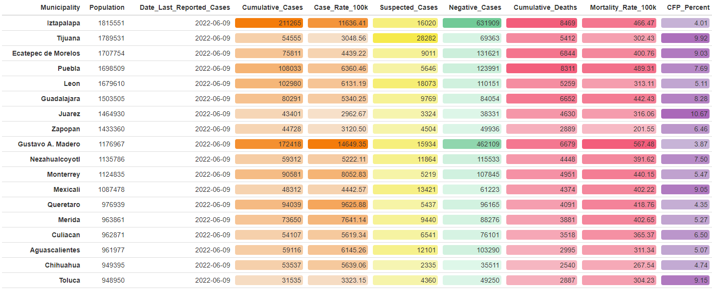

# Wrangling and Visualizing Mexico's COVID-19 Data

Data never comes in ideal formats. For this project, I had to produce a report of Mexico's COVID-19 data in a way that compiled data on cases, deaths, suspected cases, and negative cases, all of which was served up in separate csv files on an otherwise excellent platform that did not allow a direct URL connection for import. 

What's more, the wrangling process to get the data in a presentable state was intense. 

The result of the script is a full COVID report on the 20 most populous municipalities in Mexico, rendered here using the formattable package with customized colors.

 

An additional set of R functions allows users to run case and death curves for each municipality and then compile them into matrices using the patchwork package.

 

 
